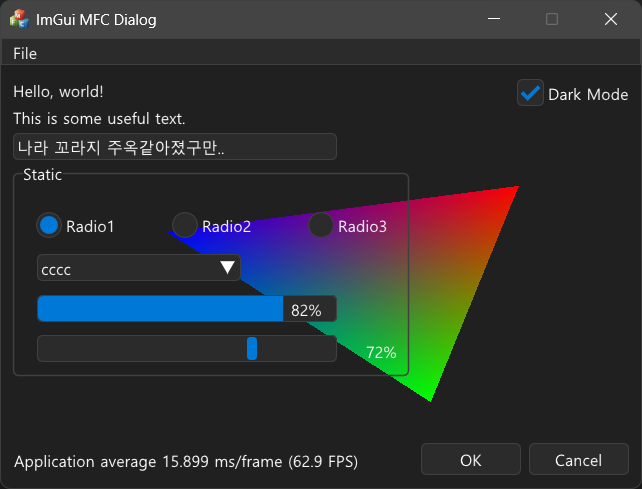
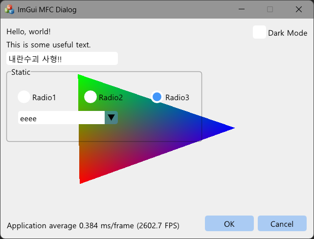

# ImGui MFC Dialog
`ImGui` + `OpenGL` backend based MFC Sample.  
As an experimental project, it seems more useful than I thought.

<figure class="half">

&nbsp;

</figure>

## References
* https://github.com/ocornut/imgui
* https://github.com/Patitotective/ImThemes
* https://codegrimie.tistory.com/65

## License
This project is licensed under the MIT License - see the [LICENSE](LICENSE.txt) file for details.
